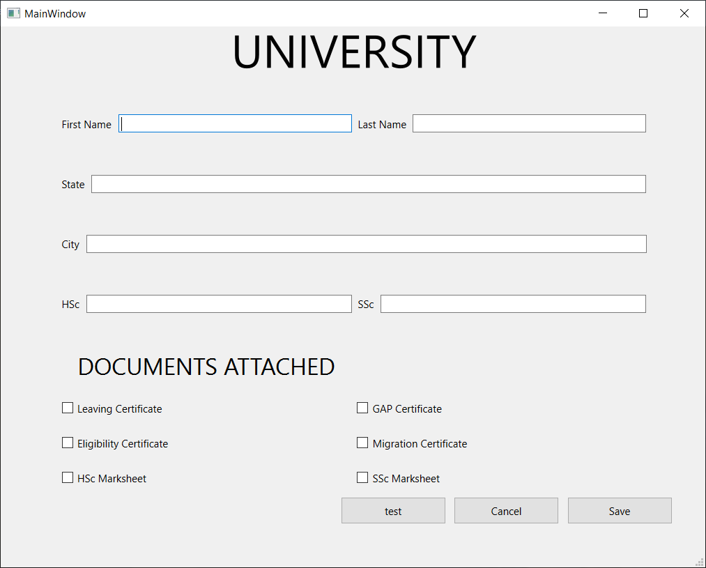

# University-Admission-QT
University admission GUI software made using QT and MySQL

**Test Button -**     Connects to database  
**Cancel Button -**   Disconnects database and quits the application  
**Save Button -**     Checks for validation then saves the user-inputed data to the MySQL database  

### Note : Application needs to be configured for specific databases before use
